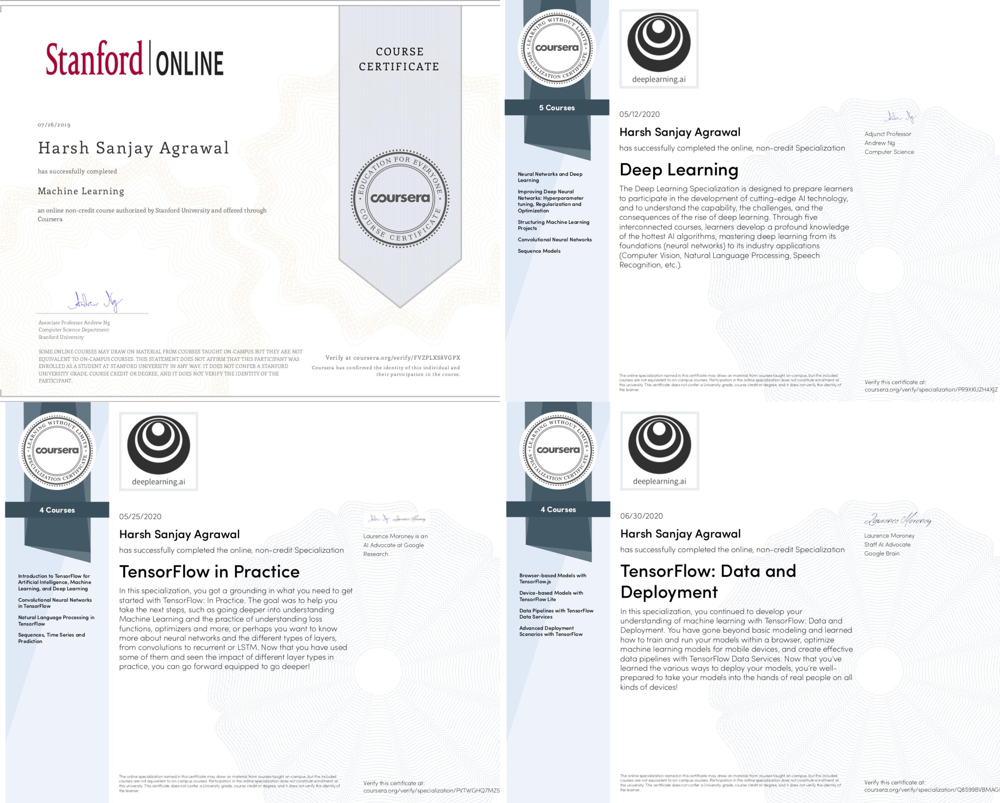

	
 

# DeepLearning.ai Machine Learning Specialisations
Deep Learning is a superpower. With it you can make a computer see, synthesize novel art, translate languages, render a medical diagnosis, or build pieces of a car that can drive itself. If that isn’t a superpower, I don’t know what is.
  

[1. Machine learning Andrew NG](../blob/master/1. Machine Learning by Stanford University/Certificate.pdf) 

This course provides a broad introduction to machine learning, datamining, and statistical pattern recognition. Topics include: (i) Supervised learning (parametric/non-parametric algorithms, support vector machines, kernels, neural networks). (ii) Unsupervised learning (clustering, dimensionality reduction, recommender systems, deep learning). (iii) Best practices in machine learning (bias/variance theory; innovation process in machine learning and AI). The course will also draw from numerous case studies and applications, so that you'll also learn how to apply learning algorithms to building smart robots (perception, control), text understanding (web search, anti-spam), computer vision, medical informatics, audio, database mining, and other areas.

 
